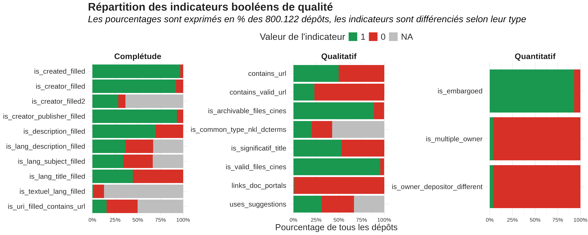

<style>

.panel, .card, .bslib-card {
    border: none !important;
    box-shadow: none !important;
}


.navbar-logo img {
  max-height: 45px; /* Ajuste la taille selon tes besoins */
  width: auto;
}

.navbar {
  background-color: #f15a24 !important; /* Remplace par la couleur souhaitée */
  border-bottom: 2px solid #f15a24; /* Optionnel : bordure sous la barre */
}

.navbar-brand {
  color: white !important; /* Couleur du titre */
  font-weight: bold !important; /* Met le titre en gras */
}

}


body {
  text-align: justify;
  background: #ECECEB;
  line-height: 1.2 !important;
  border-color: white;
}

/* Custom l'apparence des hyperliens du doc */
a:link { /*lien hyper texte*/
    color: #f15a24;
}
a:hover { /*souris au-dessus du lien hyper texte*/
    color: #f15a24;
}
a:visited { /*lien visité*/
    color: #f15a24;
}
      
</style>

```{r eval=FALSE, include=FALSE}
library(tidyverse)
library(here)
library(hrbrthemes)
library(patchwork)
Sys.setenv(OPENSSL_CONF="/dev/null")
webshot::webshot("poster.html", "poster.png", vwidth = 1550, vheight = 800)
```

## Body row {data-height=60}

###  {data-width=600}

<center>
<p style="aligne: center; font-size: 1.4em; color: white; background-color: #969696;">**Introduction**</p>
</center>

#### Le projet

Dans le cadre de ses activités, l’IR* Huma-Num propose l’entrepôt de données Nakala, ayant pour but de préserver et de disséminer les données produites par les productions des projets de recherche français en SHS. Nakala contient environ 800 000 dépôts et plus de 1 million de fichiers, entraînant une grande disparité de pratiques de contribution. De cela est né le besoin de mener une démarche d’amélioration de la qualité des dépôts dans Nakala.

#### La phase 1

La mission d’amélioration de la qualité des dépôts dans Nakala est organisée en plusieurs phases. La première, menée d'octobre 2024 à mars 2025, repose sur une exploration du contenu de Nakala. Son but était de mener un premier état des lieux, à la fois qualitatif et quantitatif des dépôts, et d'identifier de premiers éléments d’analyse de qualité.

### {data-width=600}


<center>
<p style="aligne: center; font-size: 1.4em; color: white; background-color: #969696;">**Résultats d'analyse**</p>
</center>





### {data-width=200}

<center>
<p style="aligne: center; font-size: 1.4em; color: white; background-color: #969696;">**Liens**</p>
</center>

#### Liens utiles

<FONT COLOR="#9B9FA2">
[`r fontawesome::fa("square-poll-vertical", fill = "#9B9FA2")`]() &nbsp; [Page d'analyse complète]() 

[`r fontawesome::fa("file", fill = "#9B9FA2")`]() &nbsp; [Rapport de phase 1]() 

[`r fontawesome::fa("spell-check", fill = "#9B9FA2")`](https://airtable.com/app6shAFQWBcQ4sNp/shrYm9j2n5eVA5udV) [Dictionnaire des variables](https://airtable.com/app6shAFQWBcQ4sNp/shrYm9j2n5eVA5udV)
</FONT>

<br>
<br>
<br>
<br>
<br>
<br>

<FONT COLOR="#9B9FA2">*Réalisé par Datactivist*</FONT>

## Footer row {data-height=46} 

###  {data-width=60}

<center>
<p style="aligne: center; font-size: 1.4em; color: white; background-color: #969696;">**Données et méthodologie**</p>
</center>

#### Les données utilisées

- données des **dépôts** récupérées via l'API le 4 décembre 2024, 800.122 dépôts récupérés
- données des **collections** récupérées via l'API le 8 janvier 2025, 8.379 collections récupérées
- données **externes** telles que les vocabulaires des référentiels *PACTOLS*, *BNE*, *RAMEAU* et *LCSH* ; la matrice NARA ; les types de dépôts pouvant être déposés sur NAKALA ; la liste des fichiers validables par le CINES et archivables dans PAC

#### La méthodologie

- chaque indicateur a été calculé et détaillé dans une page d'analyse
- une base finale a été construite résumant tous les indicateurs de qualité
- des croisements ont été faits entre les différents indicateurs

###  {data-width=50}

<center>
<p style="aligne: center; font-size: 1.4em; color: white; background-color: #969696;">**Conclusions**</p>
</center>

#### Synthèse

Les différents indicateurs ont permis d'approcher une mesure de la qualité des dépôts de l'entrepôt, que ce soit en termes de complétude, de quantité ou de qualité des méta-données renseignées. La part de dépôts de qualité varie d'un indicateur à un autre, s'étendant de 1 à 96%. 

#### Projections

- consolider le travail sur les métriques qualité
- réaliser une matrice qualité intégrant l’évaluation conditionnelle des données
- mettre en place un indice qualité
- restituer les analyses par un outil de pilotage


